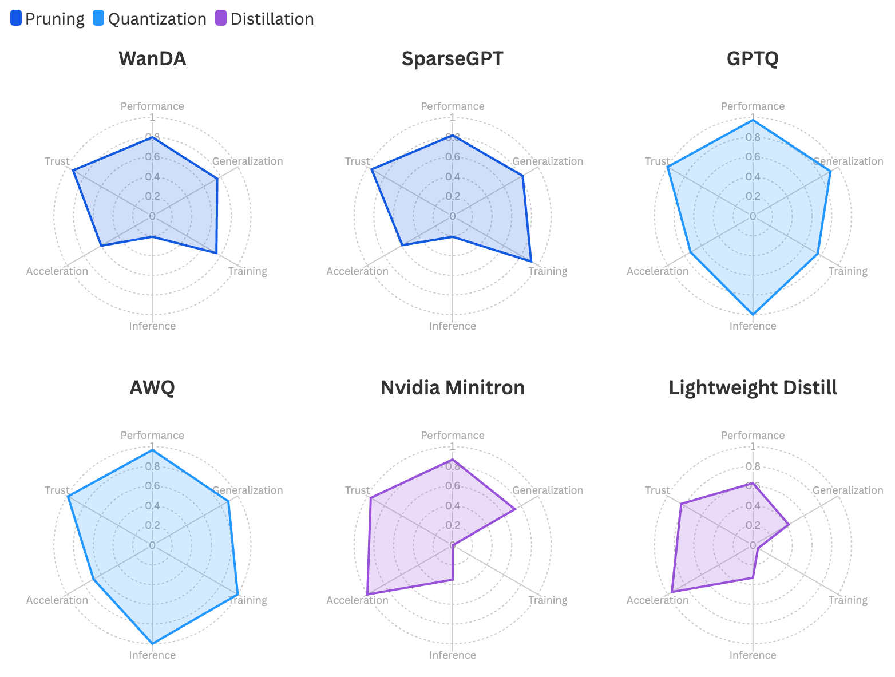

# Analyzing the Effectiveness of Pruning, Quantization & Distillation for Next-Generation LLM Compression

## Introduction

[LLMCBench: Benchmarking Large Language Model Compression for Efficient Deployment [arXiv]](https://arxiv.org/abs/2410.21352)

 The **L**arge **L**anguage **M**odel **C**ompression **Bench**mark (LLMCBench) is a rigorously designed benchmark with an in-depth analysis for LLM compression algorithms. 

 

## Usage

**IMPORTANT**: The main functionality of our repo lie in run.sh 

## II. Evaluate Reliablity

### 1. Generation
> cd TrustLLM

Edit generate_all.py --> Fill MODEL_PATH with "/path/to/target/model"
Add target model to config.py --> model_map "/path/to/target/model: model_name" and add "model_name" to openai_model array

Serve Model via vLLM on GPU: 
> conda activate vllm

> vllm serve "/path/to/target/model" \
> --host 0.0.0.0 \
> --port 8000 \
> --dtype auto \
> --api-key localtoken \
> --served-model-name model_name

Edit config.py --> openai_key="localtoken" and openai_api_base="http://localhost:8000/v1"

SSH to same Compute Node (any point where 0.0.0.0:8000 can be accessed) :
> conda activate trustllm
> python generate_all.

==> All generated responses will be stored in /UniCOMP/TrustLLM/generation_results/{current_model}"

### 2. Evaluation

> cd TrustLLM

Because the model responses will be evaluated by GPT-4 turbo we have to change the openai_key and access_point:
Edit config.py --> openai_key="Your_Token" and openai_api_base="https://api.openai.com/v1"

> conda activate trustLLM 
> python evaluate.py --model_name "path/to/model"

or

> sbatch UniCOMP/run.sh ## (only comment out python -u $CODE_DIR/TrustLLM/evaluate.py and conda activate trustllm)

==> Results will be printed 

