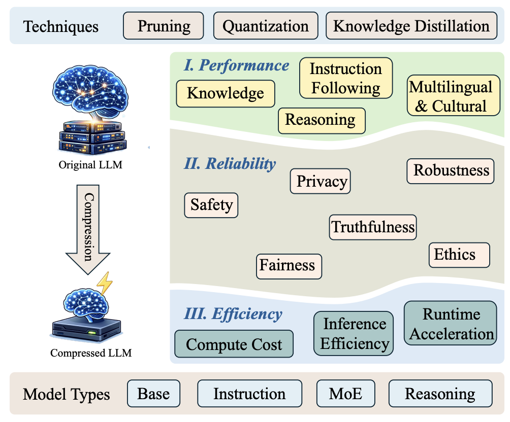

# UniComp: A Unified Evaluation of LLM Compression via Pruning, Quantization & Distillation



---

## I. Evaluate Performance

### Setup
```bash
conda create -n performance python=3.10
conda activate performance
pip install -e . -r requirements.txt
```

### Run a single eval
```bash
sbatch run_benchmark.sh llama_8b_wanda_50 knowledge
```

### Reproduce all paper results
```bash
bash sweep.sh
```

> Local pruned/distilled models must be generated first — see `compress/README.md`

---

## II. Evaluate Reliability

### Setup — two environments required
```bash
conda create -n vllm python=3.10
conda activate vllm
pip install -r requirements_vllm.txt

conda create -n trustllm python=3.10
conda activate trustllm
pip install -r requirements_trust.txt
```

### Step 1 — Generate responses

```bash
cd TrustLLM
```

1. Edit `generate_all.py` — set `MODEL_PATH` to your model path
2. Register the model in `config.py` — add `"/path/to/model": "model_name"` to `model_map` and append `"model_name"` to the `openai_model` array
3. Serve the model on GPU:
```bash
conda activate vllm
vllm serve "/path/to/model" \
  --host 0.0.0.0 \
  --port 8000 \
  --dtype auto \
  --api-key localtoken \
  --served-model-name model_name
```
4. In `config.py` set `openai_key="localtoken"` and `openai_api_base="http://localhost:8000/v1"`
5. SSH to the same compute node and run generation:
```bash
conda activate trustllm
python generate_all.py
```

> Responses are saved to `UniComp/TrustLLM/generation_results/{model_name}/`

### Step 2 — Evaluate responses

> Responses are evaluated by GPT-4 Turbo — an OpenAI API key is required.

1. Swap to OpenAI in `config.py`: set `openai_key="YOUR_KEY"` and `openai_api_base="https://api.openai.com/v1"`
2. Run evaluation:
```bash
conda activate trustllm
python evaluate.py --model_name "path/to/model"
```
Or via SLURM (uncomment the `trustllm` lines in `run.sh`):
```bash
sbatch run.sh
```

> Results are printed to stdout.
