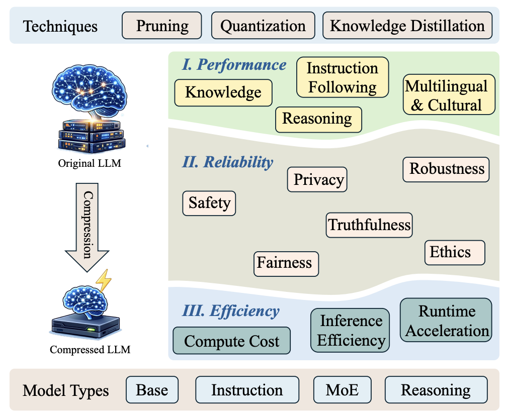

<h1 align="center">🎉 Accepted to EMNLP 2026 Main Conference 🎉</h1>

# UniComp: A Unified Evaluation of LLM Compression via Pruning, Quantization & Distillation

<p align="center">
<b>Jonathan von Rad</b>, <b>Yong Cao</b>, <b>Andreas Geiger</b>
<br>
<a href="https://arxiv.org/abs/2602.09130">📄 Paper (arXiv:2602.09130)</a>
</p>

<p align="center">

</p>

UniComp evaluates compressed LLMs along three dimensions — **performance** (knowledge, reasoning, instruction following, multilingual), **reliability** (truthfulness, safety, fairness, robustness, privacy, ethics via TrustLLM), and **efficiency** (runtime acceleration, inference footprint, compute cost) — under a single controlled experimental setting.

This is the official code release for the paper [*"UniComp: A Unified Evaluation of Large Language Model Compression via Pruning, Quantization, and Distillation"*](https://arxiv.org/abs/2602.09130), accepted to the **EMNLP 2026 Main Conference**.

## Repository layout

| Path | Purpose |
|---|---|
| `scripts/` | SLURM entry points for the performance & efficiency tracks, judge-validation tooling |
| `quantization/` | GPTQ / AWQ / SmoothQuant compression scripts + calibration-data experiments (`compress_calib.py`) |
| `reproduce_minitron_distillation/` | Teacher correction, logit distillation, and SFT scripts (Minitron reproduction) |
| `efficiency/` | FLOPs / MACs measurement (`evaluate_flops.py`) |
| `evaluate_wiki2.py` | Fixed-block WikiText-2 perplexity (+ peak-memory measurement) |
| `TrustLLM/` | Vendored, modified TrustLLM (reliability track): generation + evaluation pipeline, datasets, judge outputs |
| `data/` | Local copies of benchmark data used by TrustLLM robustness subtasks and legacy evaluators |
| `setup/` | Per-environment `requirements_*.txt` (exact versions used for the paper) |

## Setup

Four conda environments are used (they have conflicting dependency sets):

```bash
# lm-eval-harness benchmarks (knowledge, multilingual) + FLOPs + perplexity
conda create -n performance python=3.10 -y
conda activate performance && pip install -r setup/requirements_performance.txt

# lighteval benchmarks (reasoning, instruction following) + vllm bench
conda create -n light python=3.10 -y
conda activate light && pip install -r setup/requirements_light.txt

# vLLM serving + llm-compressor (compression, reliability-track generation backend)
conda create -n vllm python=3.10 -y
conda activate vllm && pip install -r setup/requirements_vllm.txt

# TrustLLM evaluation
conda create -n trustllm python=3.10 -y
conda activate trustllm && pip install -r setup/requirements_trust.txt
```

Then fill in `scripts/config.sh` (paths, conda root) and replace `YOUR_PARTITION` in the `#SBATCH` headers with your cluster's partition. All `sbatch` scripts also run directly with `bash` on a machine with a GPU.

---

## 0. Compress the models

Public quantized/distilled checkpoints (AWQ, GPTQ, Minitron-Width, LRC) are pulled from HuggingFace automatically — see the model registry in `scripts/run_performance.sh`. The remaining models are generated locally into `$MODEL_DIR`:

### Pruning (Wanda / SparseGPT)

Via [llm-compressor](https://github.com/vllm-project/llm-compressor) (used for the calibration experiments; supports custom calibration sets):

```bash
conda activate vllm
python quantization/compress_calib.py \
  --model meta-llama/Llama-3.1-8B-Instruct \
  --compression_method sparsegpt \
  --mask_structure "0:0"        # "0:0" = unstructured 50%, "2:4" = semi-structured
```

For the main-paper C4-calibrated pruned models we used the [Wanda](https://github.com/locuslab/wanda) reference implementation with default C4 calibration:

```bash
git clone https://github.com/locuslab/wanda.git pruning/wanda
python pruning/wanda/main.py \
  --model meta-llama/Llama-3.1-8B-Instruct \
  --prune_method wanda \                # or sparsegpt
  --sparsity_ratio 0.5 \
  --sparsity_type unstructured \        # or 2:4
  --save_model "$MODEL_DIR/pruned/Llama-3.1-8B-Instruct-wanda-0.5"
```

> Our [fork of Wanda](https://github.com/jvonrad/wanda) adds configurable calibration datasets and additional model support; `compress_calib.py` reproduces the same functionality via llm-compressor.

To get actual hardware acceleration from 2:4 sparsity in vLLM, export the pruned model with llm-compressor's sparse-2:4 + FP8 example:

```bash
python llm-compressor/examples/sparse_2of4_quantization_fp8/llama3_8b_2of4.py --fp8
```

### Quantization (GPTQ / AWQ / SmoothQuant)

```bash
conda activate vllm

# GPTQ (weight-only INT4/INT8)
python quantization/gptq.py --model_path meta-llama/Llama-3.1-8B-Instruct \
  --output_dir "$MODEL_DIR/quantized/llama-3.1-8b-gptq4" --bits 4

# AWQ (weight-only INT4)
python quantization/quantize_awq.py --model meta-llama/Llama-3.1-8B-Instruct \
  --output_dir "$MODEL_DIR/quantized/llama-3.1-8b-awq4"

# SmoothQuant (W8A8) — llm-compressor reference recipe
python llm-compressor/examples/quantization_w8a8_int8/llama3_example.py
```

All compression scripts print **compression time and peak GPU memory**, which feed the compute-cost efficiency score.

### Distillation (Minitron reproduction)

`reproduce_minitron_distillation/` contains the three stages we used to reproduce the Minitron-Depth student:

```bash
python reproduce_minitron_distillation/teacher_correction.py --checkpoint meta-llama/Llama-3.1-8B
python reproduce_minitron_distillation/distill_llama_student.py --help   # pruning + logit distillation
python reproduce_minitron_distillation/supervised_finetuning.py --help   # student SFT
```

Minitron-Width (`rasyosef/Llama-3.1-Minitron-4B-Chat`) and the LRC students (`JitaiHao/LRC-*-SFT`) are public checkpoints.

---

## I. Evaluate Performance

```bash
sbatch scripts/run_performance.sh <model_key> <benchmark>
# e.g.
sbatch scripts/run_performance.sh llama_8b_wanda_50 knowledge
```

| Benchmark key | Datasets | Harness |
|---|---|---|
| `knowledge` | MMLU, ARC-C, ARC-E, HellaSwag, PIQA, WinoGrande | lm-eval-harness (`performance` env) |
| `reasoning` | GSM8K (4-shot), MATH-500 (4-shot), GPQA-Diamond (5-shot) | lighteval + vLLM (`light` env) |
| `instruction` | IFBench | lighteval + vLLM (`light` env) |
| `multilingual` | Global-MMLU (12 languages) | lm-eval-harness (`performance` env) |
| `bbq` | BBQ | lm-eval-harness (`performance` env) |

Reproduce every performance-track number from the paper:

```bash
bash scripts/sweep.sh
```

Notes:
- GPTQ checkpoints: add `,gptqmodel=True` to `--model_args`.
- LRC students are not vLLM-compatible: use `lighteval accelerate` instead of `lighteval vllm`.
- Generative benchmarks use deterministic greedy decoding; multiple-choice tasks use log-likelihood scoring (both deterministic).

---

## II. Evaluate Reliability (TrustLLM)

> The general process: first serve the model via vLLM and generate responses to all benchmark prompts (saved as JSON). Then judges (GPT-4 family / Longformer classifier) score the responses.

### Step 1 — Generate responses

1. Edit `TrustLLM/generate_all.py` — set `MODEL_PATH` to your model path.
2. Register the model in `TrustLLM/trustllm_pkg/trustllm/config.py`: add `"/path/to/model": "model_name"` to `model_info["model_mapping"]` **and** append `"model_name"` to the `openai_model` list (don't forget the trailing comma).
3. Serve the model:

```bash
conda activate vllm
vllm serve "/path/to/model" \
  --host 0.0.0.0 --port 8000 \
  --dtype auto --api-key localtoken \
  --served-model-name model_name
```

4. In `config.py` set `openai_key="localtoken"` and `openai_api_base="http://localhost:8000/v1"`.
5. From a machine that can reach that endpoint (on SLURM: SSH to the same compute node):

```bash
conda activate trustllm
python TrustLLM/generate_all.py
```

Responses are saved to `TrustLLM/generation_results/{model_name}/`.

### Step 2 — Evaluate responses

> Judged by the OpenAI API (GPT-4-Turbo) plus a local Longformer classifier — an OpenAI API key is required.

1. In `config.py` switch to the OpenAI API: `openai_key="YOUR_KEY"`, `openai_api_base="https://api.openai.com/v1"`.
2. Run:

```bash
conda activate trustllm
cd TrustLLM
python evaluate.py --model_name "/path/to/model"
```

Aggregated scores are written to `TrustLLM/saved_evaluations/<model>/scores.json`; per-subtask judge outputs are snapshotted alongside them.

### LLM-as-judge validation (human agreement study)

The judge-validation pipeline from the paper (200 stratified samples, human-annotated):

```bash
# 1. Sample 100 judged instances per judge (GPT / Longformer), stratified over subtasks
python scripts/sample_judge_outputs_by_judge.py --eval_dir TrustLLM/saved_evaluations/<model>

# 2. Manually annotate: fill the "human_label" field in judge_validation_{gpt,longformer}.json

# 3. Score agreement (accuracy, Cohen's kappa, bootstrap CI, per-subtask breakdown)
python scripts/score_judge_agreement.py --eval_dir TrustLLM/saved_evaluations/<model>
```

Our annotated validation files for `qwen-2.5-7b-smooth` are included under `TrustLLM/saved_evaluations/qwen-2.5-7b-smooth/`.

---

## III. Evaluate Efficiency

```bash
sbatch scripts/run_efficiency.sh <model_path_or_hf_id> <metric>
# metric: throughput | latency | flops | perplexity | all
```

The efficiency score aggregates three sub-tracks:

| Sub-track | What is measured | How |
|---|---|---|
| Runtime acceleration | Throughput (tok/s), latency | `vllm bench throughput` / `vllm bench latency` (1024 input / 16 output tokens, random dataset) |
| Inference footprint | FLOPs, MACs, parameter count, peak GPU memory, model size | `efficiency/evaluate_flops.py` (calflops), `evaluate_wiki2.py` peak-memory report, checkpoint size on disk |
| Compute cost | Compression wall-clock time, peak GPU memory during compression | printed by the compression scripts in `quantization/` and llm-compressor |

Notes:
- Speedups only materialize with backend-compatible formats: quantized models must be in a vLLM-supported scheme, and 2:4-pruned models must be exported via llm-compressor's sparse-2:4 path (see Section 0). Unstructured 50% sparsity gets **no** runtime benefit on current GPUs.
- For LRC models add `--model-impl transformers` to the `vllm bench` calls.

---

## IV. Calibration-data experiments (Section 5.4)

Reasoning-aware calibration (ARC + GSM8K + MATH instead of C4) for pruning and AWQ:

```bash
conda activate vllm
python quantization/compress_calib.py \
  --model meta-llama/Llama-3.1-8B-Instruct \
  --compression_method wanda \          # wanda | sparsegpt | awq
  --mask_structure "0:0"                # 0:0 = unstructured, 2:4 = semi-structured
```

The resulting checkpoints (`*-arc-gsm8k-math`) are then evaluated with the standard performance track (model keys `*_reasoning` in `scripts/run_performance.sh`).

---

## Data & licenses

- Benchmark datasets vendored in `data/` and `TrustLLM/dataset/` retain the licenses and terms of their original releases (MMLU © Dan Hendrycks, MIT; TrustLLM datasets per the TrustLLM toolkit; etc.). See `TrustLLM/LICENSE` for the vendored TrustLLM code.
- Model checkpoints are subject to their respective licenses (Llama 3.x Community License, Qwen License, etc.).

## Citation

If you find UniComp useful, please cite:

```bibtex
@inproceedings{vonrad2026unicomp,
  title     = {UniComp: A Unified Evaluation of Large Language Model Compression via Pruning, Quantization, and Distillation},
  author    = {von Rad, Jonathan and Cao, Yong and Geiger, Andreas},
  booktitle = {Proceedings of the 2026 Conference on Empirical Methods in Natural Language Processing (EMNLP)},
  year      = {2026}
}
```
